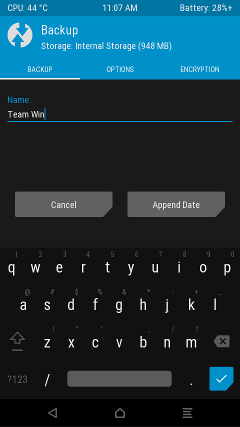

##### Team Win Recovery Project 3.x, or twrp3 for short, is a custom recovery built with ease of use and customization in mind. Its a fully touch driven user interface no more volume rocker or power buttons to mash. The GUI is also fully XML driven and completely theme-able. You can change just about every aspect of the look and feel.

    * Your warranty is now void.
    * I am not responsible for bricked devices, dead SD cards,
    * thermonuclear war, or your getting fired because the alarm app failed. Please
    * do some research if you have any concerns about features included in this ROM
    * before flashing it! YOU are choosing to make these modifications, and if
    * you point the finger at me for messing up your device, I will laugh at you.

Supported Models
-------------
Galaxy S23 Ultra: S918B, S918N and S9180.

Download & Guide
-------------
                
1. Unlock your bootloader.
2. Downloads for Galaxy S23 Ultra: [dm3q](https://www.androidfilehost.com/?w=files&flid=337496)
3. Reboot to download mode
4. Uncheck auto reboot in Odin and flash TWRP in AP slot and [vbmeta_disabled.tar](https://github.com/afaneh92/android_device_samsung_dm3q/raw/github.io/docs/vbmeta_disabled.tar) in USERDATA slot.
5. Hold volume down and power until the screen goes black then immediately switch to holding volume up and power to reboot into TWRP.
6. Go to wipe, format data, and type "yes" to confirm.
7. Reboot to TWRP
8. Flash [boot_repack.zip](https://github.com/afaneh92/android_device_samsung_dm3q/raw/github.io/docs/boot_repack.zip) (To fix stock recovery restoration)
9. Flash magisk (Optional)
10. Reboot to system, Enjoy.
                
Support
-------------
Live support is available via #twrp on Freenode with your IRC client or just [click this link](http://webchat.freenode.net/?channels=twrp).

[Telegram group](https://t.me/+Z8u1Nc2dTrs2YjQ0)

Bugs
-------------
- Decryption will only work if no password/PIN/pattern is set in Android.
- No erofs r/w support yet.
     

Thanks
-------------
* TWRP team
* @BlackMesa123 for helping me to add encryption support
* @dr.ketan for supporting me​
* Donators

Sources
-------------
[Kernel tree](https://github.com/afaneh92/android_kernel_samsung_sm8550)

[Device tree](https://github.com/afaneh92/android_device_samsung_dm3q)

Changelog
-------------
[GitHub History](https://github.com/afaneh92/android_device_samsung_dm3q/commits/android-12.1)
